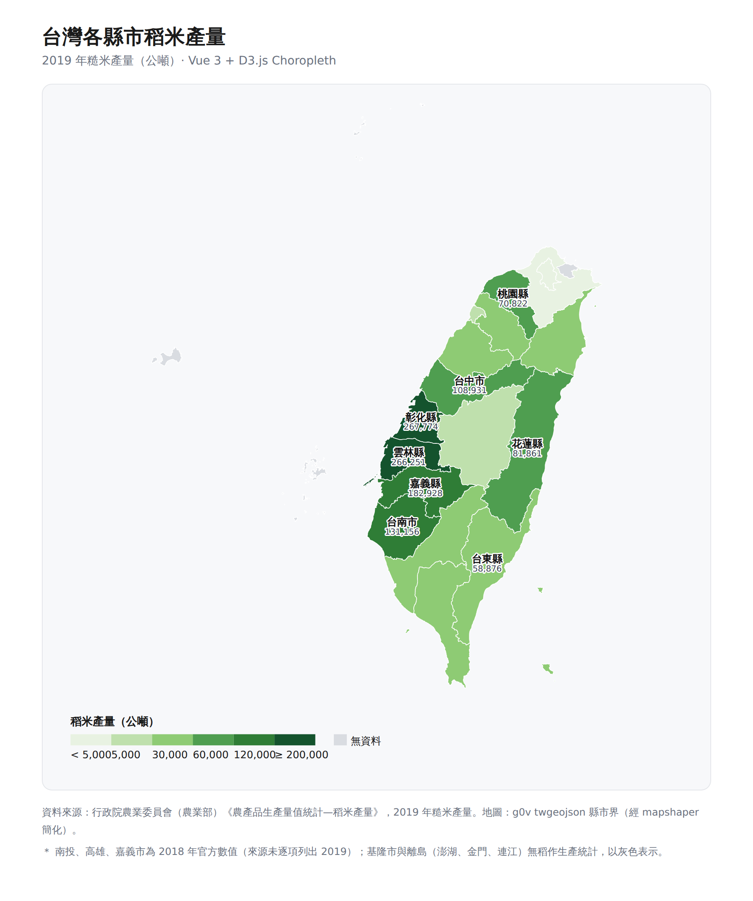
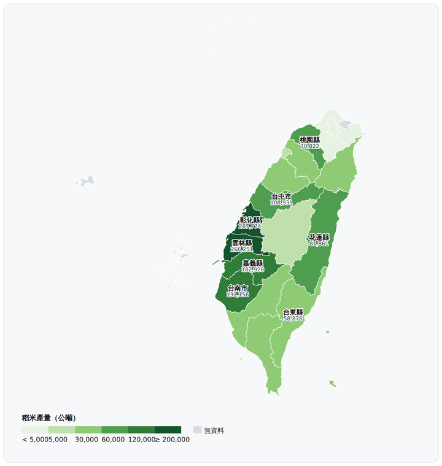

# 1151VIS-HW1｜台灣各縣市稻米產量視覺化（Vue 3 + D3.js）

資料分析與視覺化應用 HW1。以 **Vue 3（Composition API）+ Vite** 建置，將 **D3.js 當作函式庫 import**，製作台灣各縣市稻米產量的 **choropleth（分級著色地圖）**。地圖封裝成一個 Vue 元件 `ChoroplethMap.vue`：D3 負責地理投影、比例尺與繪圖，Vue 負責畫面與響應式 tooltip。

## 專案截圖



### 動態示範（滑鼠移過各縣市顯示 tooltip）



## 技術棧

- **Vue 3**（`<script setup>` Composition API）
- **Vite**（開發伺服器與打包）
- **D3.js v7**（`d3-geo` 投影與路徑、`d3-scale` 色階、`d3-selection` 繪圖）

## 執行方式

```bash
# 1. 安裝相依套件
npm install

# 2. 開發模式（熱更新，預設 http://localhost:5173）
npm run dev

# 3. 打包正式版（輸出到 dist/）
npm run build
npm run preview   # 本機預覽打包結果
```

## 專案結構

```
.
├── index.html                    # Vite 進入點
├── package.json                  # 相依套件與指令
├── vite.config.js
├── src/
│   ├── main.js                   # 掛載 Vue App
│   ├── App.vue                   # 版面、標題、資料來源
│   ├── components/
│   │   └── ChoroplethMap.vue     # ★ 核心：Vue + D3 地圖元件
│   └── data/
│       ├── taiwan-counties.json  # 縣市界 GeoJSON（邊界資料）
│       └── riceData.js           # 各縣市稻米產量 + 色階設定
├── public/
│   ├── screenshot.png            # 專案截圖
│   └── demo.gif                  # 操作示範
└── .gitignore
```

## 核心元件怎麼運作（`ChoroplethMap.vue`）

於 `onMounted` 內，用 D3 繪圖；tooltip 以 Vue 的 `reactive` 狀態由 D3 事件更新：

1. **資料結合（join）**：以縣市名稱為 key，把 `riceData.js` 的產量寫進每個 GeoJSON feature 的 `properties`。
2. **投影 + 路徑**：`d3.geoMercator().fitExtent()` 依資料自動置中縮放，`d3.geoPath()` 轉成 SVG `<path>`。
3. **色階**：`d3.scaleThreshold()` 切成 6 級單一色相（綠）；無資料給灰色。
4. **資料綁定**：`d3.select(svgRef).selectAll('path').data(features).join('path')`。
5. **標註**：`path.centroid()` 取重心，標出前 8 大產區名稱與數字。
6. **圖例**：手繪色塊 + 級距文字。
7. **互動**：D3 的 `mousemove`/`mouseleave` 更新 Vue 的 `tip` 響應式狀態，由 `<template>` 顯示 tooltip —— D3 管地理與繪圖、Vue 管畫面與互動狀態。

## 主題與資料來源

以地圖呈現 2019 年各縣市稻米（糙米）產量，可看出稻作集中於中部（彰化、雲林、嘉義）與南部（台南）平原，東部（花蓮、台東）次之。

- **稻米產量**：行政院農業委員會（現農業部）《農產品生產量值統計—稻米產量》，2019 年糙米產量（公噸）。18 個縣市為 2019 精確值；南投、高雄、嘉義市因來源未逐項列出 2019 數字，退用 2018 官方值（tooltip 以 `＊` 標註）；基隆與離島（澎湖、金門、連江）官方無稻作統計，以灰色「無資料」表示。
- **地圖邊界**：[g0v twgeojson](https://github.com/g0v/twgeojson) 縣市界 GeoJSON（2010 行政區），以 mapshaper 簡化。

## 技術重點 / 遇到的坑

- **GeoJSON 繞行方向（winding order）**：mapshaper 簡化後多邊形外環方向與 d3-geo 的球面運算相反，d3 會把每個縣市誤判成「覆蓋整個地球」，整張圖塌成一塊綠色矩形。解法：用 `@mapbox/geojson-rewind` 將外環改為順時針，`d3.geoBounds` 即回傳正確的台灣範圍（經度 118–122、緯度 22–26）。
- **Vue × D3 分工**：D3 直接操作 SVG DOM；tooltip 則交給 Vue 響應式狀態，避免兩者搶同一塊 DOM，是常見且乾淨的整合模式。

## GitHub 連結

Repository: https://github.com/Duncan8805/1151VIS-HW1-414085210-TsengChenYu

## 作者

曾辰宇（Duncan）
