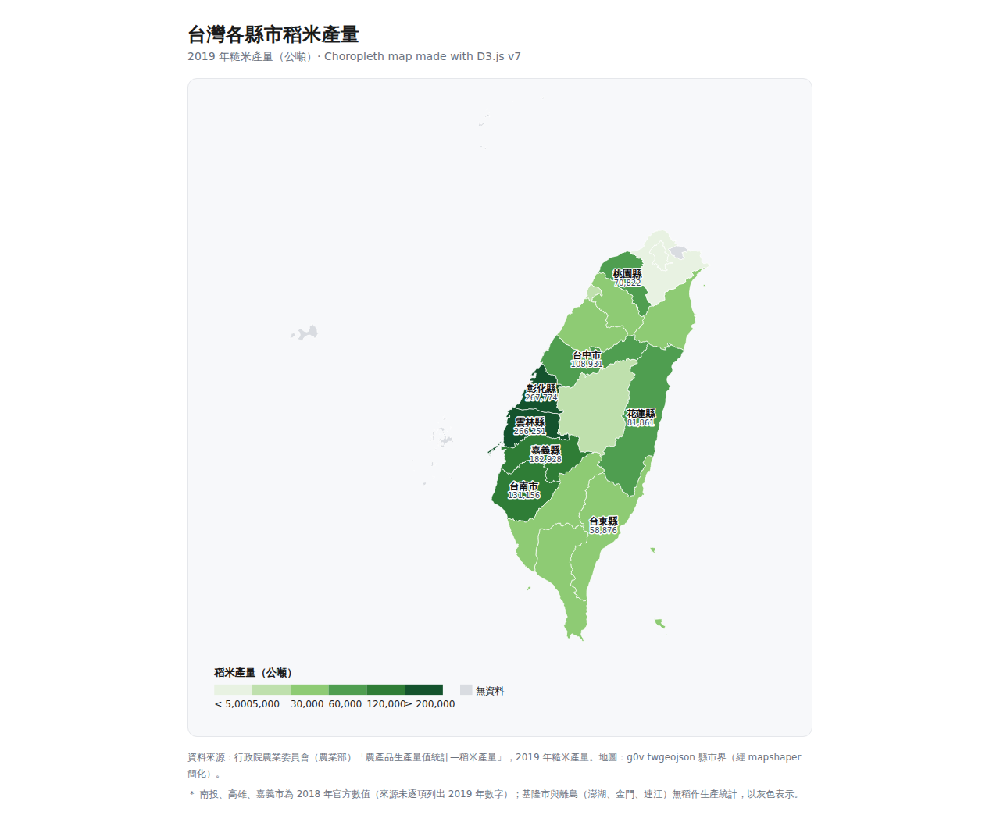
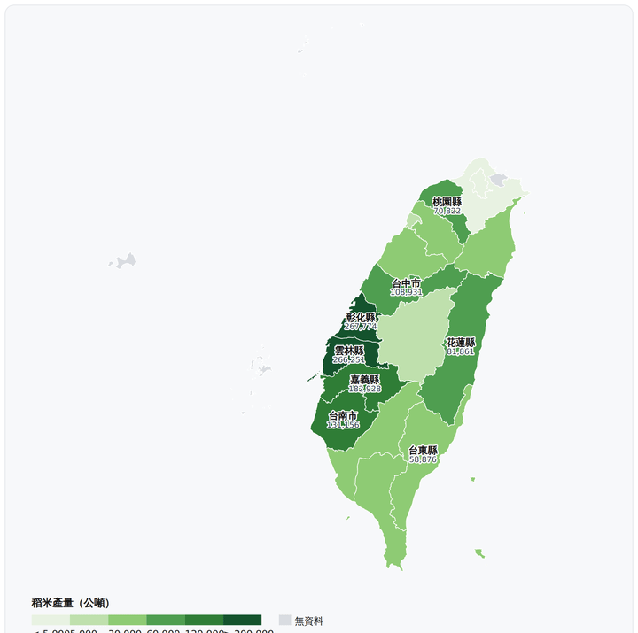

# 1151VIS-HW1｜台灣各縣市稻米產量視覺化

資料分析與視覺化應用 HW1。使用 **D3.js v7** 製作的台灣各縣市稻米產量 **choropleth（分級著色地圖）**，為一張靜態視覺化（static visualization）。所有程式、D3 函式庫與地圖資料都內嵌在單一 `index.html`，直接用瀏覽器開啟即可呈現，不需架設伺服器、離線亦可執行。

## 專案截圖



### 動態示範（滑鼠移過各縣市顯示 tooltip）



## 主題

以地圖呈現 2019 年台灣各縣市的稻米（糙米）產量，一眼看出稻作集中在中部（彰化、雲林、嘉義）與南部（台南）平原，東部（花蓮、台東）次之，北部都會與離島幾乎不產稻。choropleth 能同時練到 D3 的地理投影、路徑生成、比例尺、色階與圖例，是地理型視覺化最經典的題型。

## 資料來源

- **稻米產量**：行政院農業委員會（現農業部）《農產品生產量值統計—稻米產量》，2019 年糙米產量（公噸）。
  - 18 個縣市為 2019 年精確值；南投、高雄、嘉義市因來源未逐項列出 2019 數字，退用 2018 年官方值（圖下與 tooltip 以 `＊` 標註）。
  - 基隆市與離島（澎湖、金門、連江）官方無稻作生產統計，以灰色「無資料」表示。
- **地圖邊界**：[g0v twgeojson](https://github.com/g0v/twgeojson) 縣市界 GeoJSON（2010 行政區），以 mapshaper 簡化後內嵌。

## 製作流程與相關操作

1. **取得地圖邊界**：下載 g0v `twCounty2010.geo.json`（原始約 9.3 MB，含 22 個縣市）。
2. **簡化地圖**：用 `mapshaper` 將頂點簡化至約 4%（`-simplify 4% keep-shapes`），檔案縮到約 200 KB，才能直接內嵌進 HTML。
3. **整理稻米資料**：把各縣市 2019 年糙米產量（公噸）整理成對照表。
4. **資料結合（join）**：以縣市名稱為 key，將產量寫進每個 GeoJSON feature 的 `properties.rice`，畫圖時直接讀取。
5. **D3 繪製**（對應 `index.html` 內的註解 1–6）：
   - **投影 + 路徑**：`d3.geoMercator().fitExtent(...)` 依資料自動置中縮放，`d3.geoPath()` 把經緯度多邊形轉成 SVG `<path>`。
   - **色階**：`d3.scaleThreshold()` 把連續產量切成 6 級單一色相（綠）；`null` 給灰色「無資料」。
   - **資料綁定**：`selectAll("path").data(features).join("path")`。
   - **標註**：用 `path.centroid()` 取每個縣市重心，替前 8 大產區加名稱與數字。
   - **圖例**：手繪色塊 + 級距文字。
   - **互動**：滑鼠移過顯示 tooltip（即使純截圖、不互動也能完整判讀）。
6. **修正繞行方向（winding）bug**：見下節。

## 執行方式

直接用瀏覽器開啟 `index.html` 即可（D3.js v7 與 GeoJSON 皆已內嵌，離線可執行，無需本機伺服器）。

## 技術重點 / 遇到的坑

- **GeoJSON 環繞方向（winding order）**：mapshaper 簡化後輸出的多邊形外環方向與 d3-geo 的球面運算期望相反，導致 d3 把每個縣市誤判為「覆蓋整個地球」，整張圖塌成一塊綠色矩形。
  解法：用 `@mapbox/geojson-rewind` 將外環改成**順時針**後，`d3.geoBounds` 回傳正確的台灣範圍（經度 118–122、緯度 22–26），地圖即正常顯示。這是 D3 地圖最常見的坑。
- **本機載入 GeoJSON 的 CORS 問題**：若用 `d3.json()` 讀本機 `.json`，以 `file://` 開啟會被 CORS 擋。本專案改為把 GeoJSON 直接內嵌成 JS 變數，徹底避開此問題，雙擊即可開。

## 檔案結構

```
.
├── index.html       # 主程式（內嵌 D3 v7 + GeoJSON + 稻米資料）
├── screenshot.png   # 專案執行截圖
├── .gitignore
└── README.md
```

## GitHub 連結

Repository: https://github.com/Duncan8805/1151VIS-HW1-414085210-TsengChenYu

## 作者

曾辰宇（Duncan）
